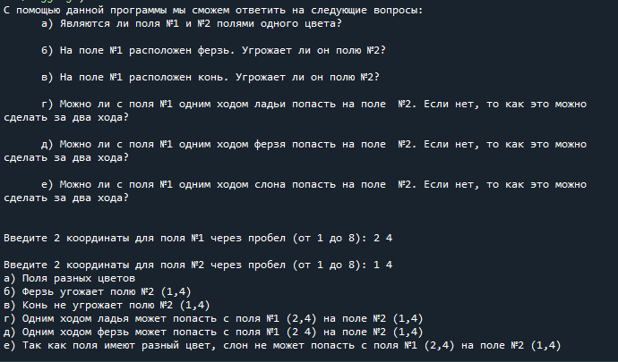

# Шахматная доска

Назначение программы
-----
Программа предназначена для ответов на следующие вопросы:

   а) Являются ли поля №1 и №2 полями одного цвета?

   б) На поле №1 расположен ферзь. Угрожает ли он полю №2?

   в) На поле №1 расположен конь. Угрожает ли он полю №2?

   г) Можно ли с поля №1 одним ходом ладьи попасть на поле  №2. Если нет, то как это можно сделать за два хода?

   д) Можно ли с поля №1 одним ходом ферзя попасть на поле  №2. Если нет, то как это можно сделать за два хода?

   е) Можно ли с поля №1 одним ходом слона попасть на поле  №2. Если нет, то как это можно сделать за два хода?

Запуск программы
-----
Программу следует запускать в среде, поддерживающей язык программирования Python. После запуска необходимо ввести по 2 координаты для двух полей.

Выполения  программы
-----

